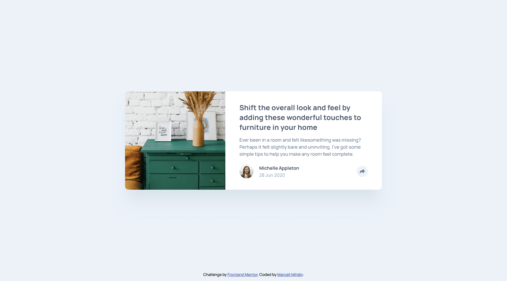

# Frontend Mentor - Article preview component solution

This is a solution to the [Article preview component challenge on Frontend Mentor](https://www.frontendmentor.io/challenges/article-preview-component-dYBN_pYFT). Frontend Mentor challenges help you improve your coding skills by building realistic projects.

## Table of contents

- [Overview](#overview)
  - [The challenge](#the-challenge)
  - [Screenshot](#screenshot)
  - [Links](#links)
- [My process](#my-process)
  - [Built with](#built-with)
  - [What I learned](#what-i-learned)
  - [Useful resources](#useful-resources)
- [Author](#author)

## Overview

### The challenge

Users should be able to:

- View the optimal layout for the component depending on their device's screen size
- See the social media share links when they click the share icon

### Screenshot

Desktop

---

Desktop - Active

---

Mobile

---

Mobile - Active

### Links

- Solution URL: [https://github.com/mihalymarcell86/article-preview-component](https://github.com/mihalymarcell86/article-preview-component)
- Live Site URL: [https://mihalymarcell86.github.io/article-preview-component/](https://mihalymarcell86.github.io/article-preview-component/)

## My process

### Built with

- Semantic HTML5 markup
- Sass, CSS animation
- Vanilla JS
- Mobile-first workflow

### What I learned

I practiced animating with this project.
I learned about the `animation-fill-mode` property, which allows the animation to apply styles to the target element before or after execution. It is easy to trip up on it as well: if one wants to change that given property, one has to remove the animation first, otherwise it "keeps hold" of it.

### Useful resources

- [cubic-bezier](https://cubic-bezier.com/) - Very straight forward visual UI for comparing cubic-bezier curves.

## Author

- GitHub - [@mihalymarcell86](https://www.github.com/mihalymarcell86)
- Frontend Mentor - [@mihalymarcell86](https://www.frontendmentor.io/profile/mihalymarcell86)
